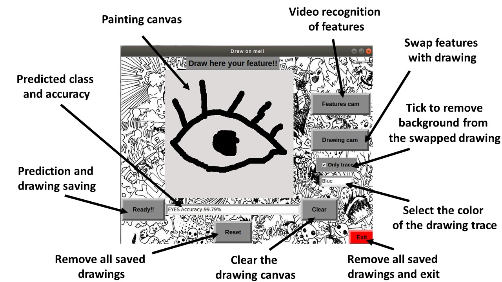

# **Draw-me!**
  <head>
    
  </head>
  <body>
     <!-- Inline parent element -->
      
    
  </body>

Draw me! is several things at the same time. It is a quick drawing classifier. It is a face features recognition and tracking engine. It is a features swapping application.

## How does it work?

The app provides a drawing canvas where the user can use the mouse to quick sketch a feature (eye, nose, mouth, eyeglasses or hat). The user can then save the image that will be fed to a trained neural network that will guess the feature.

Then, the user can launch the webcam through the app (feature swapping button). This will trigger some haar cascade classifiers that will recognice the features from the video and substitute them with the drawn features.

Quick start guide:
  <head>
    
  </head>
  <body>
     <!-- Inline parent element -->
      
    
  </body>

## Under the hood: main modules used
+   Keras==2.3.1
+   matplotlib==3.2.1
+   numpy==1.18.2
+   opencv-python==4.2.0.34
+   pandas==1.0.3
+   scikit-learn==0.22.2
+   tensorflow==2.2.0
+   Tkinter==8.6

### **Click the image for a demo video:**

